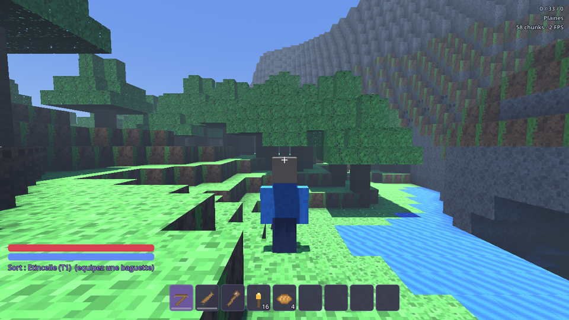
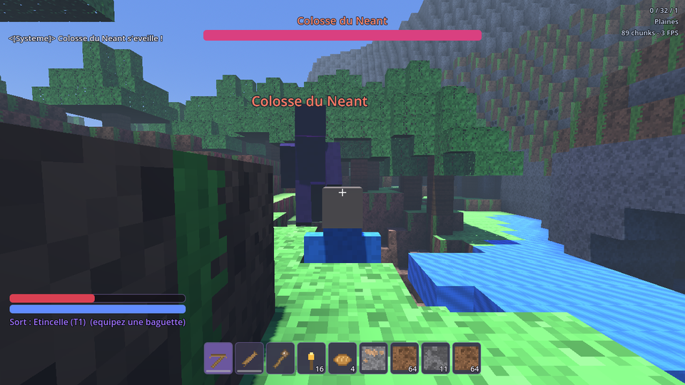
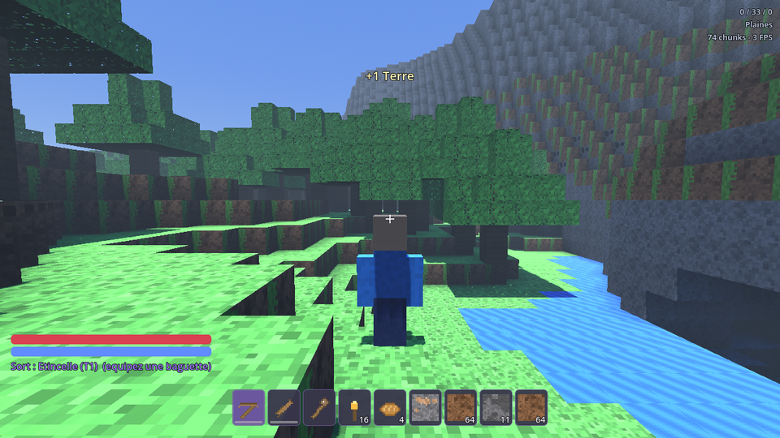

# VoxelMage

Jeu de survie voxel 3D façon Minecraft, avec un système de **magie qui détruit
le décor de plus en plus fort** au fil de la progression. Multijoueur intégré :
l'hôte lance le serveur **depuis l'application elle-même**, sans logiciel tiers.

Moteur : **Godot 4.4** · Sorties : **Windows (.exe)**, **Android (.apk)**, **Web**
Tous les assets (textures, icônes, skins) sont **générés par code** — aucun
fichier externe, aucune licence à surveiller.



---

## Sommaire

1. [Installer et jouer](#installer-et-jouer)
2. [Commandes](#commandes)
3. [Le jeu](#le-jeu)
4. [La magie](#la-magie)
5. [Jouer en ligne](#jouer-en-ligne)
6. [Développement](#développement)
7. [Compilation automatique (GitHub)](#compilation-automatique-github)
8. [Architecture du code](#architecture-du-code)
9. [Limites connues](#limites-connues)

---

## Installer et jouer

Les binaires sont produits automatiquement à chaque tag `v*` et publiés dans
l'onglet **Releases** :

| Plateforme | Fichier | Notes |
|---|---|---|
| Windows | `VoxelMage.exe` | Un seul fichier, rien à installer |
| Android | `VoxelMage.apk` | Autoriser « sources inconnues » à l'installation |
| Navigateur | GitHub Pages | Solo uniquement (voir [Limites](#limites-connues)) |

---

## Commandes

### Clavier / souris

| Touche | Action |
|---|---|
| `Z Q S D` / `W A S D` / flèches | Se déplacer |
| `Espace` | Sauter (nager vers le haut dans l'eau) |
| `Maj` | S'accroupir · `Ctrl` : courir |
| **Clic gauche** | Miner · frapper · **lancer un sort si une baguette est en main** |
| **Clic droit** | Poser un bloc · ouvrir un coffre, un four, un établi, un autel |
| `F` | Lancer un sort (même avec un outil en main) |
| `C` / `X` | Sort suivant / précédent |
| Molette | Changer d'emplacement dans la barre rapide |
| `1`–`9` | Barre rapide · `E` : inventaire · `Q` : jeter |
| `T` | Chat (`Échap` pour en sortir) · `F5` : vue 3ᵉ personne · `Échap` : pause |

Au lancement, **un clic dans la fenêtre capture la souris** (obligatoire dans un
navigateur, où le verrouillage du pointeur exige un geste). Un rappel s'affiche
à l'écran tant que ce n'est pas fait.

### Tactile (Android)

Joystick analogique à gauche, glissement à droite pour la caméra, boutons
**Miner / Poser / Sort / Saut / Accroupi / Courir**, plus **Sac** et **Sort >**
en haut à droite. Les boutons pilotent exactement les mêmes actions que le
clavier, donc les deux modes restent synchronisés.

---

## Le jeu

**7 biomes** générés par bruit de Perlin : Plaines, Forêt, Désert, Montagnes,
Toundra, Marais et **Terres arcaniques** (roche du Néant, minerai de mana,
spires). Grottes, veines de minerai par profondeur, arbres, cactus et **ruines**
contenant coffres et autel.

**35 blocs** et une trentaine d'items : outils en bois / pierre / fer /
arcanite (avec durabilité), nourriture, potions, baguettes, tomes.

| Station | Rôle |
|---|---|
| Établi | Recettes 3×3 (l'inventaire donne accès au 2×2) |
| Four | Fusion : minerai → lingot, sable → verre, minerai de mana → cristaux |
| Coffre | 27 emplacements, **partagé et synchronisé** entre joueurs |
| Autel arcanique | Infusion : améliore la baguette T1 → T5 |
| Table de runes | Maîtrise arcanique : +12 % dégâts et +6 % rayon par niveau |

**Créatures** : Gelée (saute), Décharné (corps à corps, la nuit), Spectre (tire
des projectiles, lâche parfois un Cœur du Néant).

**Boss — le Colosse du Néant** : invoqué en utilisant un Cœur du Néant sur un
autel. 420 PV, **trois phases** (ondes de choc qui pulvérisent le terrain,
volées de projectiles, invocation de sbires). Barre de vie dédiée à l'écran.



---

## La magie

C'est le cœur du jeu. Chaque sort a un **rang de destruction** : il ne
désintègre que les blocs dont la résistance magique est inférieure ou égale.
Plus la baguette monte, plus le paysage y passe.

| Sort | Rang | Mana | Effet | Détruit |
|---|---|---|---|---|
| Étincelle | 1 | 4 | Trait rapide | terre, sable, bois |
| Élan | 1 | 8 | Bond arcanique | — |
| Éclat de mana | 2 | 11 | Explose à l'impact (r≈2) | + la pierre |
| Nova | 3 | 26 | Onde circulaire (r≈4) | + les minerais |
| Soin runique | 3 | 22 | Rend des PV | — |
| Rayon du Vide | 4 | 34 | Fore un tunnel droit | + l'arcanite |
| Cataclysme | 5 | 75 | Météore (r≈7) | **tout, même l'obsidienne** |

Un Cataclysme creuse un cratère de plusieurs centaines de blocs — mesuré par le
test automatique : **399 blocs désintégrés** en un lancer.



Progression : baguette T1 (bâton + cristal) → infusions successives à l'autel
(cristaux, arcanite, puis un Cœur du Néant pour la T5) → gravure de runes pour
la maîtrise.

---

## Jouer en ligne

**L'hôte n'a besoin de rien d'autre que le jeu.** Menu → *Héberger une partie* :
l'application ouvre un serveur (port `24565`) et continue à jouer normalement.

### Trouver une partie

| Situation | Comment |
|---|---|
| Même réseau (maison, box, partage de connexion) | Les parties **apparaissent toutes seules** dans la liste (balise UDP sur le port 24566) |
| Sur Internet | Le joueur colle le **code direct** (8 caractères) ou l'IP de l'hôte |
| Liste publique | Lue depuis un `servers.json` (GitHub Pages) et/ou un annuaire dynamique |

### Les deux codes, expliqués franchement

Une adresse IPv4 + un port, c'est 40 bits d'information : **impossible à faire
tenir dans 6 caractères** sans un serveur qui fasse la correspondance. D'où deux
codes, affichés tous les deux dans le menu pause :

* **Code court — 6 caractères** (ex. `K7M2QX`) : c'est une *clé de salon*. Elle
  fonctionne sans aucune infrastructure **sur un réseau local** (le jeu la
  retrouve par balise UDP). Sur Internet, elle ne marche que si un
  [annuaire](directory/README.md) est configuré.
* **Code direct — 8 caractères** (ex. `C4H2M0A1`) : il **contient** l'adresse et
  le port de l'hôte (base32 Crockford, sans les lettres I, L, O, U pour éviter
  les confusions à l'oral). Il fonctionne **partout, sans serveur tiers**.

Le champ « Rejoindre » accepte les deux, plus une IP brute (`192.168.1.20:24565`).

### Hébergement Internet

Pour être joignable depuis l'extérieur, il faut que le port **24565 (TCP)** soit
ouvert vers la machine hôte : redirection de port sur la box, ou un tunnel
(`ngrok tcp 24565`, Tailscale, ZeroTier…). C'est la contrainte habituelle de
tout serveur auto-hébergé.

### Liste publique sans rien payer

* `docs/servers.json` est publié par GitHub Pages à chaque build. Pour ajouter un
  serveur permanent : une pull request sur ce fichier.
* Pour une liste **vivante** et des codes courts utilisables partout, le dossier
  [`directory/`](directory/README.md) contient un annuaire de 150 lignes, sans
  dépendances, déployable en une commande (Fly.io, Render, Docker…). Il reste
  **entièrement optionnel** : à coller dans *Options → Annuaire dynamique*.

### Ce qui transite sur le réseau

Le monde est **déterministe** : à partir de la graine, chaque client regénère un
terrain identique (vérifié par le test automatique). Seules les **modifications**
circulent, compressées en Zstd — un joueur qui se connecte reçoit la graine plus
le dictionnaire des blocs changés, pas le monde entier.

L'hôte fait autorité sur les créatures, le boss, les coffres et les fours ;
les inventaires personnels et le craft sont côté client (jeu coopératif entre
amis, pas de protection anti-triche).

---

## Développement

```bash
# 1. Regénérer les assets (Pillow requis)
pip install pillow numpy
python3 tools/generate_assets.py

# 2. Ouvrir le projet
godot -e                     # ou : godot project.godot

# 3. Lancer le test automatique (monde + craft + magie + entités + captures)
xvfb-run -a godot --rendering-driver opengl3 --smoke
```

Deux suites de tests tournent en local comme en CI :

```bash
xvfb-run -a godot --rendering-driver opengl3 --smoke       # monde, craft, magie
xvfb-run -a godot --rendering-driver opengl3 --inputtest   # souris, clavier, UI
```

Le mode `--smoke` génère un monde avec une graine fixe, vérifie que le terrain
porte le joueur, que les recettes répondent, que la magie creuse bien, que les
créatures et le boss apparaissent, puis écrit trois captures et rend un code de
sortie exploitable par la CI.

Exports manuels :

```bash
godot --headless --export-release "Windows Desktop" build/windows/VoxelMage.exe
godot --headless --export-release "Android"         build/android/VoxelMage.apk
godot --headless --export-release "Web"             build/web/index.html
```

---

## Compilation automatique (GitHub)

`.github/workflows/build.yml` s'exécute à chaque poussée :

1. installe Godot 4.4.1 et les templates d'export (mis en cache) ;
2. régénère les assets depuis le script Python ;
3. importe le projet et **échoue si un script contient la moindre erreur** ;
4. lance le test de fumée **et le test des commandes** sous Xvfb, puis
   **publie les captures** en artefacts ;
5. exporte le `.exe`, l'`.apk` (signé) et la version web ;
6. publie la version web + `servers.json` sur **GitHub Pages** ;
7. sur un tag `v1.0.0`, crée la **Release** avec le `.exe` et l'`.apk`.

Sans configuration, l'APK est signé avec une clé de debug générée à la volée.
Pour une vraie signature, ajouter trois secrets au dépôt :
`ANDROID_KEYSTORE_BASE64`, `ANDROID_KEY_ALIAS`, `ANDROID_KEY_PASSWORD`.

Publier une version :

```bash
git tag v1.0.0 && git push origin v1.0.0
```

---

## Architecture du code

```
project.godot            autoloads Boot (touches) et Net (réseau)
scenes/Main.tscn         scène unique ; tout le reste est construit par code
tools/generate_assets.py génère blocks.png, items.png, les skins et l'icône
scripts/
  core/      Blocks, Items, Inventory, Recipes, Spells      (données du jeu)
  world/     Chunk (maillage + occlusion ambiante)
             WorldGen (biomes, grottes, minerais, arbres, ruines)
             VoxelWorld (streaming threadé, raycast DDA, destruction sphérique)
  entities/  CharacterModel (humanoïde voxel + pseudo flottant)
             Player, Mob, Boss, Projectile
  net/       Net (hébergement + RPC), RoomCode, LanDiscovery, Directory
  ui/        UiKit, HUD, InventoryUI, MainMenu, UIRoot, TouchControls
  game/      Boot (carte des touches), Game (orchestrateur + logique hôte)
directory/               annuaire optionnel (Node, sans dépendances)
docs/                    servers.json publié + captures
```

Choix techniques notables : maillage des chunks sur un **thread de travail**
(occlusion ambiante par sommet, assombrissement selon la profondeur), collisions
reconstruites en même temps que le maillage, **WebSocketMultiplayerPeer** comme
transport unique (natif + navigateur), et un joueur **gelé tant que le sol sous
ses pieds n'est pas chargé** — sinon il traverse le monde au démarrage.

---

## Limites connues

* **Version web et multijoueur** : une page servie en HTTPS (GitHub Pages) ne
  peut ouvrir qu'une connexion `wss://` chiffrée. Un hôte domestique n'a pas de
  certificat TLS : depuis le navigateur, le **solo fonctionne**, le multijoueur
  demande les versions Windows / Android (ou une page servie en HTTP simple).
* Un navigateur ne peut pas *héberger* : c'est une limite du bac à sable web.
* Inventaires joueurs côté client : parfait entre amis, sans plus.
* Pas d'objets au sol : les ressources minées vont directement dans l'inventaire.
* Distance d'affichage volontairement modeste (5 chunks, 4 sur mobile) pour que
  ça tourne sur téléphone.

---

## Licence

Code et assets générés : libres d'utilisation, de modification et de
redistribution.
